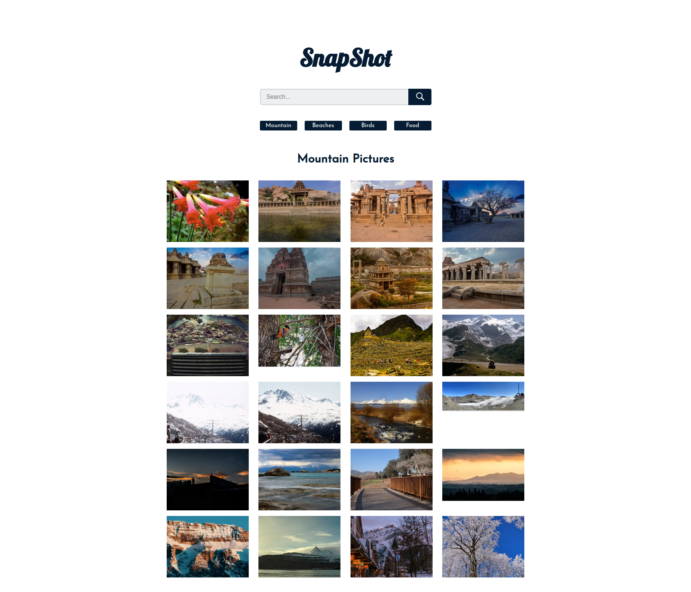

<h1 align="center">
 
</h1>
<h4 align="center"><b>CI/CD  - DockerHub, Azure Container Registry and Azure Container Insance </b></h4>

## About ℹ️ 

This project showcases the CI/CD workflow with GitHub Actions for a React Image Search application. Please note that you don't need to install node or react to run this project :)

## Three Major Tasks 🧑‍💻

- Containarize the React Application
- CI - build and deploy the Docker Image to DockerHub (Public) and Azure Container Registry - ACR (Private)
- CD - Pull the image and deploy to Azure Container Instance (ACI) to make it accessible to the internet


## GitHub Actions Workflows ⚒️

Two workflows files are created under .giithub/workflows directory
- push.dockerhub.yaml 
- azure-container-deploy.yaml 

These worflows are triggered whenever any commit or Pull Request is made to the main branch. 


***1. Get Started - Setting up GitHub Secret for DockerHub***

Fork or clone and push this repo to your account. Go to Repository Settings-> Secretes and Variables -> New Repository Secret and add the following values:

`DOCKER_USERNAME`

`DOCKER_ACCESS_TOKEN`

***2. Setting up Azure Credentials and Service Principle***


- Download Azure CLI from [here](https://docs.microsoft.com/en-us/cli/azure/install-azure-cli?view=azure-cli-latest), run `az login` to login with your Azure Credentials.
-  Run following command
```bash

    az ad sp create-for-rbac --name "ava-photos" --role contributor \
        --scopes /subscriptions/{subscription-id}/resourceGroups/{resource-group} \
        --sdk-auth
    
    # Replace {subscription-id}, {resource-group} with the subscription, resource group details of the WebApp
    # The command should output a JSON object similar to this:

  {
    "clientId": "<GUID>",
    "clientSecret": "<GUID>",
    "subscriptionId": "<GUID>",
    "tenantId": "<GUID>",
    (...)
  }
```
- Paste the json response from above Azure CLI to your GitHub Repository > Settings > Secrets > Add a new secret > **AZURE_CREDENTIALS**

***3. Creating Azure Container Registry***

Create Azuure Container Registry ([Instructions](https://learn.microsoft.com/en-us/azure/container-registry/container-registry-get-started-azure-cli)) and grab the following values to add it the following resposiorty secretes as earlier:


`REGISTRY_LOGIN_SERVER`

`REGISTRY_USERNAME`

`REGISTRY_PASSWORD`

`RESOURCE_GROUP`


**4.  Test the worflow and find your application**

Test the CI/CD Pipeline by updating any of the codebase content and pushing the commits to main branch. Example -> change the website title under public/index.html

Go to Actions Tab in your repository to see the workflow buids, logs and error messages (if any).

If everything is successful, go to Azure Container Instance and find the FQDN or Public IP address to access your application. Eg.

    
    testdomain.g8c8axfadkedgwb7.centralindia.azurecontainer.io

    20.219.173.119


## Building you own image (Local Testing)


```bash
# Clone the repo and navigate to the project directory
cd docker-react-ci-cd

# Building image. (See Dockefile for reference)
# example
$ docker build -t {image_name}:{version} . 
$ docker built -t 977977/avaphotos:1.0 .

# Start Container
$ docker start -d -p3000:3000 --name ava-photo-app 977977/avaphotos:1.0

# Go to localhost:3000 to access the application

# Stop Container 
$ docker stop ava-photo-app
```

## Contributions

Contributions are highly appreciated. Please send a Pull Request with suggested changes or open an Issue to get things started!